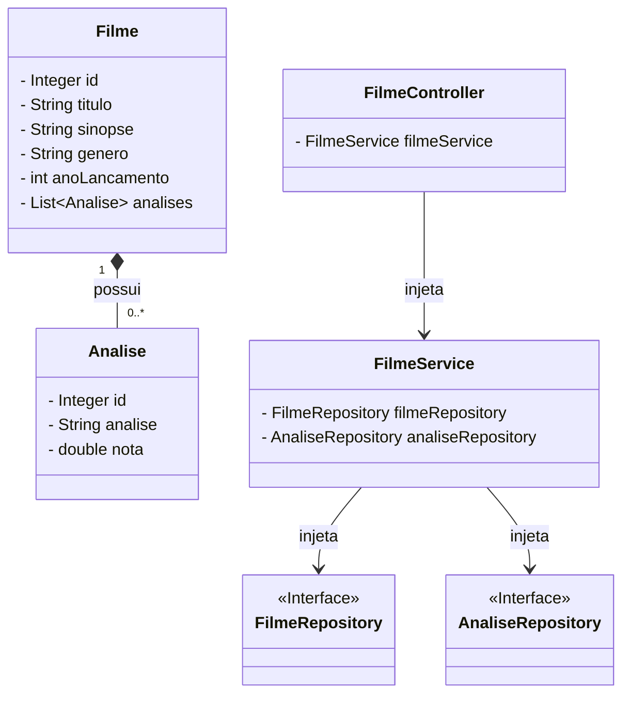

# Cinema Management System

## Description

**Objective:** Provide a comprehensive web-based platform for managing a movie catalog and user reviews.

**Problem Solved:** Streamlines the process of cataloging films and tracking user ratings through an integrated solution. It provides a robust, server-side rendered application that securely handles business logic and database transactions.

**Project Context:** Full-Stack web application integrating a Java Spring Boot backend with a Thymeleaf frontend, rigorously following the MVC architectural pattern.


## Preview


---

## About the Project

This system is built with a clear separation of concerns using the strict MVC (Model-View-Controller) architecture. The backend, powered by Java 21 and Spring Boot 3, handles business logic and data persistence via Spring Data JPA and MySQL. The frontend uses Thymeleaf for dynamic Server-Side HTML Rendering (SSR), seamlessly integrating backend data into the views.

Additionally, the project features a dark mode toggle that persists user preference using browser cookies, ensuring a personalized experience across sessions.

### System Architecture (UML)

Below is the UML class diagram illustrating the entity relationships, specifically how Movies (Filme) relate to their respective Reviews (Analise) within the database, and how the MVC layers interact.



---

## Features

* Full CRUD Operations: Create, Read, Update, and Delete movies
* Server-Side Rendering (SSR) dynamic views using Thymeleaf
* Rating System mapping a relational database structure (Movie <-> Reviews)
* Dark Mode toggle with state persistence via Cookies
* Clear MVC architecture separating backend logic from frontend presentation
* Automated Health-Check endpoint to prevent cloud server sleep

---

## Deploy

The project is containerized with Docker and hosted in the cloud using Render, with the database hosted on Aiven.

**Access the application:** [Deploy on Render](https://cinema-catalog-api.onrender.com/filmes)

---

## How to Run

### Prerequisites

* Java Development Kit (JDK) 21
* Apache Maven
* MySQL Server installed and running
* A Java IDE (IntelliJ IDEA, Eclipse, VS Code)

---

### Clone the Repository

```bash
git clone github.com/v-charles/cinema-management-system.git
cd cinema-management-system

```

---

### Database Configuration

Thanks to Spring Boot's Hibernate integration (`ddl-auto=update`), **you do not need to run any SQL scripts manually**. The tables will be created automatically when you start the application.

Navigate to `src/main/resources/application.properties` and configure your database credentials using Environment Variables in your IDE, or replace them directly for local testing:

```properties
# Database Connection (Example for Local Environment)
spring.datasource.url=${SPRING_DATASOURCE_URL:jdbc:mysql://localhost:3306/cinema_db}
spring.datasource.username=${SPRING_DATASOURCE_USERNAME:root}
spring.datasource.password=${SPRING_DATASOURCE_PASSWORD:your_password}

# Hibernate properties
spring.jpa.hibernate.ddl-auto=update
spring.jpa.show-sql=true

```

---

### Execution

To run the application using Maven from your terminal:

```bash
./mvnw spring-boot:run

```

Alternatively, open the project in your IDE and run the main `Application.java` class.

The system will be available at: `http://localhost:8080`

---

## Web Routes (Controllers)

The application follows traditional server-side routing. These are the main endpoints exposed by the Controllers:

| HTTP Method | Route | Description |
| --- | --- | --- |
| GET | `/` | Redirects to the main movies catalog |
| GET | `/filmes` | Renders the view with all registered movies |
| GET | `/filmes/cadastro` | Renders the form to register a new movie |
| POST | `/filmes/salvar` | Processes the form and saves a new movie |
| GET | `/filmes/{id}` | Renders the details and reviews of a specific movie |
| POST | `/filmes/{id}/adicionar-analise` | Processes and saves a new review for a movie |
| GET | `/health` | Returns a 200 OK status for cloud cron-jobs |

---

## Author

Developed by [Vinicius Charles Macedo Dias](https://www.linkedin.com/in/vinicius-charles/)
